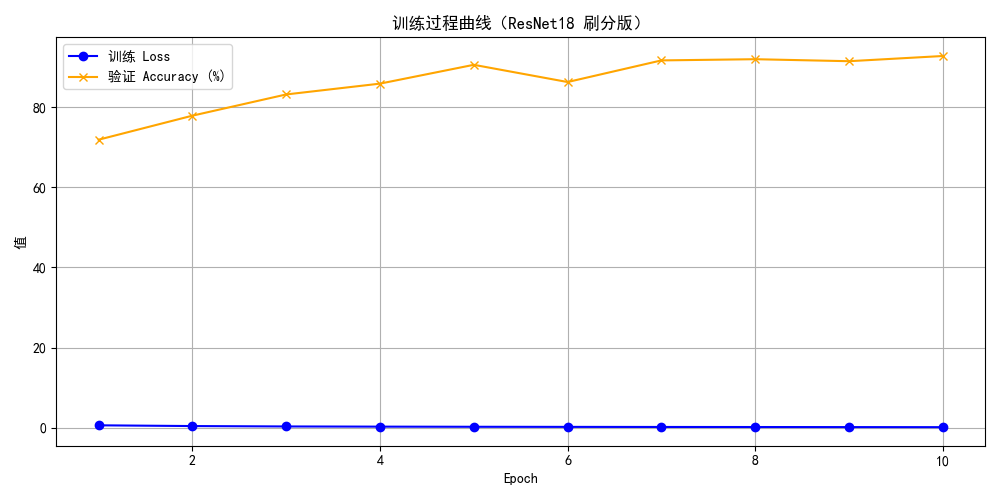

# Cat vs Dog Image Classifier with ResNet18 + Grad-CAM

This project builds a deep learning pipeline for binary image classification (cat vs dog) using **PyTorch** and **ResNet18**, with integrated **Grad-CAM visualization**, **training monitoring**, and a **Gradio-powered web demo**.

## Features

- **Model:** ResNet18 (customized for 2-class classification)
- **Training:** Full training loop with accuracy/loss curves and CSV logging
- **Visualization:** Grad-CAM heatmaps for interpretability
- **Deployment:** Gradio web interface for live image prediction
- **Auto-download dataset:** Filtered Cats and Dogs dataset (TensorFlow version)

## Demo Screenshot



## Folder Structure
```
├───.gradio
│   └───flagged
│       ├───image
│       │   └───f26ab72748a62647b300
│       └───output
│           └───e117890c9dfc3bb3b604
├───data
│   └───cats_and_dogs_filtered
│       ├───train
│       │   ├───cats
│       │   └───dogs
│       └───validation
│           ├───cats
│           └───dogs
├───app.py
├───cat_dog_model_resnet18.pth
├───model.py
├───predict.py
├───requirements.txt
├───train.py
├───train_log_resnet.csv
├───train_resnet.py
├───train_curve_resnet.png
├───requirements.txt
├───utils.py
└───__pycache__
```

##  How to Run

### 1. Install dependencies (suggested environment: Python 3.9+)

```bash
pip install torch torchvision matplotlib gradio tqdm
```

### 2. Train the model (optional - model already provided)

```bash
python train_resnet.py
```

### 3. Run prediction (CLI)

```bash
python predict.py
```

### 4. Run the Gradio web interface

```bash
python app.py
```

Then open your browser:  
**Local:** http://127.0.0.1:7860  
**Public:** (auto-generated if `share=True` is set in `app.py`)

## Model Visualization (Grad-CAM)

The model's attention region for a given prediction is visualized using Grad-CAM, which overlays a heatmap showing "where" the model looked in the image.

## Dataset

We use the `cats_and_dogs_filtered` dataset from TensorFlow's public repository (automatically downloaded via `utils.py`):

- 24349 training images (cats and dogs, balanced)  
- 1,000 validation images  

## License

MIT License. For educational and research purposes.
